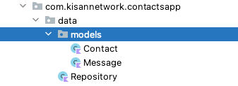
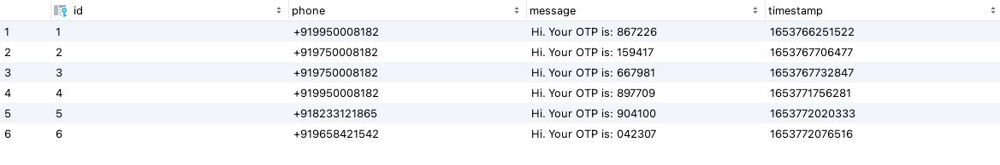

## ContactApp
Android application which send sms to contacts imported from JSON File.

### ContactApp 	-	Kisan Network

### Author		: 	Ranjeet Chouhan
 
### App Screenshot

## Content
Project Structure
Architecture Used
Library Used
SMS API Used
Database Used
Performance 
Mock Data Used

## Project Structure

## Notes
Latest Android Studio version is used. (Android Studio Chipmunk | 2021.2.1)
No Harded values is used in views
API Keys/API Secret is placed in Build.gradle. So, it won’t be retrievable in 
reverse-engineering of application.
100% Kotlin code with latest dependencies
Minimalistics User Interface
Tabs Layout with ViewPager2 is being used. 

## Data
Data package contains models and repository used in app. 
Two models used in app. Contact and Message

Repository class contains methods which retrieve data from json file or local database in 
case of sent message list.

## Database

Database package contains classes regarding room database. Room database is used   to store sent message into local storage and retrieving list of already sent message with otp.
MessageDao is containing abstract methods for operations into database

## Extensions

Constants class is used to store all compile-time constant used in application and Utils 
class is contains some reusable methods or methods and variable which can be reused.

## Network
Network package is contain all classes related to network call. In this app i used Retrofit 
library for network call

## User Interface 
ui package is contains subpackages and classes related to view/screens of applications.

## Base
All BaseActivity which is being used for some common code related to activity and can 
be reused.

## Contactlist
Contact List contains fragment which is being used at home screen for see list of 
contacts from json file. Apart from fragment it is also contains related ViewModel and 
ViewModelFactory

## Details
Details contains Activity related to contact details. 

## Home
Home contains all classes related to home screen with its viewmodel. From home 
screen view can interact with ContactList or OTPList fragment

## OTPList
OTP List contains fragment which is being used at home screen for see list of 
Messages already sent to contact. Apart from fragment it is also contains related 
ViewModel and ViewModelFactory. Data is fetched from local storage.

## Sendotp
Send otp package included all files related to view of sending otp screens.

## Architecture

Model-View-ViewModel architecture pattern is used in this project. Each view class has its own ViewModel which fetch data from Repository.
Likewise : 

## Library

For Network Call
Retrofit library is used for network call
GSON Conversation factory is used for serialization/deserialization 
Database
Room database is used
Image Loading
Coil (Kotlin) library is used to load images like user profile pictures from url.

## SMS API

Nexmo VONAGE SMS API is used. The limitations is in demo account your can send message to only verified number and all other numbers will be go to non-wishlisted number. I created account with +919750008182 and verified same. While in testing i am successfully receiving sms. You can test this app by replacing api_key/api_secret in Build.gradle with different account which have your number verified.

While sending sms to other phone number here is response i am receiving:
“Non-Whitelisted Destination. Your Vonage account is still in demo mode. While in demo mode you must add target numbers to your whitelisted destination list”

Link : https://identity.nexmo.com/login

## Database

Room database is used to store all message sent successfully through application.
Database name is “message_database”
Table Schema : 

## Performance

RecyclerView is used in optimize way so, it won’t lags scrolling and frames of ui won’t freeze if number of rows or data is increased. It is tested with current json. Current json is having ~7000 data items or contacts and recyclerview is successfully showing this data in efficient way and smooth scrolling.

## Mock Data

Mock contact data is created by myself. ~10 items are uniques and rest are repeated items included for performance testing. Profile pictures are random pictures getting from open source mock user pictures provider available online.

